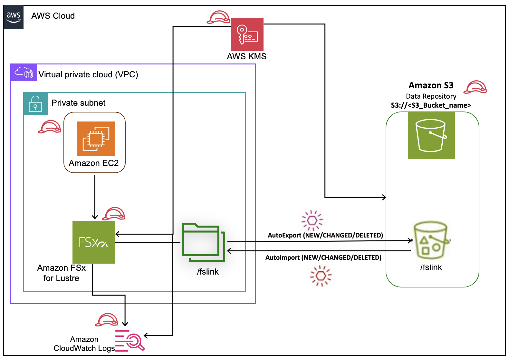

## Provision FSx for Lustre Filesystem using a Terraform

This repository contains Terraform code that automates the deployment of an Amazon FSx for Lustre filesystem on AWS, along with an EC2 instance and S3 integration. The module streamlines the process of:

1. Provisioning an FSx for Lustre filesystem
2. Establishing a Data Repository Association (DRA) between FSx for Lustre and an S3 bucket
3. Creating an EC2 instance
4. Mounting the FSx for Lustre filesystem with the S3-linked DRA on the EC2 instance

This module is ideal for teams looking to quickly set up a high-performance computing environment with integrated storage, compute resources, and S3 data access. By combining FSx for Lustre's powerful storage capabilities, EC2's flexible compute options, and S3's scalable object storage, you can efficiently tackle data-intensive workloads in machine learning, high-performance computing, and big data analytics.


## Architecture


## AWS Services Used
- FSx for Lustre
- S3
- EC2
- CloudWatch Alarms
 
 ## Prerequisites
 To deploy this Terraform module  Application you will need the following
 - [Active AWS Account](https://aws.amazon.com/premiumsupport/knowledge-center/create-and-activate-aws-account/) 
 - [Least privilege IAM policy](https://aws.amazon.com/blogs/security/techniques-for-writing-least-privilege-iam-policies/)
 - [Terraform](https://developer.hashicorp.com/terraform/tutorials/aws-get-started/install-cli) 

## Repository Structure 
The repository is organized into two main directories:

1. modules/: Contains all child modules required for the FSx deployment:
    
    * FSx for Lustre filesystem
    * Data Repository Association (DRA)
    * CloudWatch
    * EC2 instance
    * Security Group

2. fsx_deployment/: The parent module that orchestrates the entire solution.

The `fsx_deployment` directory serves as the entry point for deploying the solution. It sources all necessary modules from the modules folder to create a comprehensive FSx for Lustre environment. You can easily customize the deployment by adjusting the configuration values in the parent module. This allows you to tailor the solution to your specific requirements without modifying the underlying modules.

## Deploy via Terraform
To deploy this solution, navigate to the `fsx_deployment` directory. Make sure oyu configure the required variables in your variables.tf files.
Once you done with all changes execute below steps to deploy solution.

>**Note:**
>
> Please update the `vpc_id`, `subnet_id`, `data_repository_path`, `iam_instance_profile`, `kms_key_id`(KMS key arn) variables values as per your deployment need into `terraform.tfvars` file before deployment. Also, update the CIDR range for `fsx_inress` and `fsx_egress` of security group variables into `local.tf`.
> Make sure you add `AmazonSSMManagedInstanceCore` managed policy to `iam_instance_profile` role.

>**Tip:**
>
>Amazon FSx does provide a default method to facilitate the integration with S3,EC2,CloudWatch etc. 
>FSx for Lustre file system uses the default AWS-managed service-linked role named `AWSServiceRoleForFSx`. 

To initialize the environment to run this terraform module:

```
$ terraform init
```

It is also necessary to have a plan to execute. 

```
$ terraform plan -var-file terraform.tfvars
```

Now you can deploy the Terraform to AWS.

```
$ terraform apply -var-file terraform.tfvars
```

## Cleanup
Finally, to cleanup and remove the stack from the AWS account you can run the command below from `fsx_deployment` directory. 


```
$ terraform destroy
```

## Benefits

1. Modular Design: Easily maintain and update individual components.
2. Scalability: Quickly deploy consistent environments across different AWS accounts or regions.
3. Flexibility: Customize the deployment to fit your specific needs.
4. Best Practices: Leverage pre-configured modules that follow AWS best practices.

By leveraging Terraform, this module simplifies the process of creating and managing FSx for Lustre filesystems, allowing you to harness the power of high-performance storage without the complexity of manual setup.

## Security

See [CONTRIBUTING](CONTRIBUTING.md#security-issue-notifications) for more information.

## License

This library is licensed under the MIT-0 License. See the LICENSE file.
